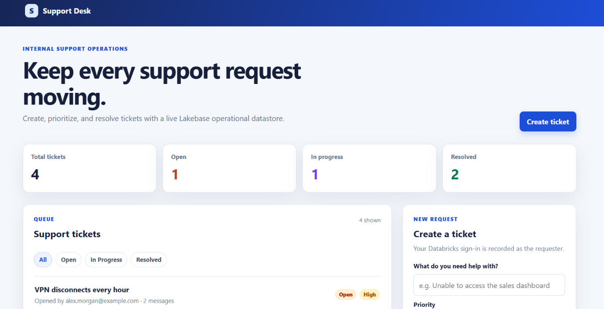
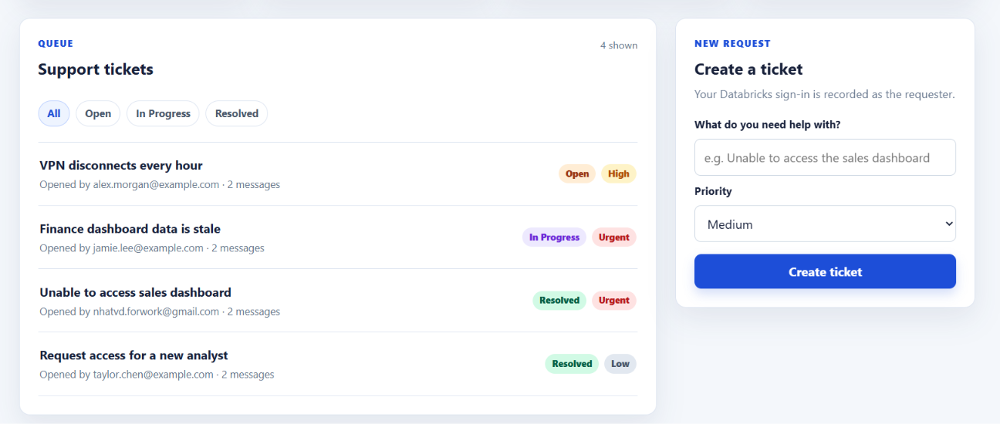
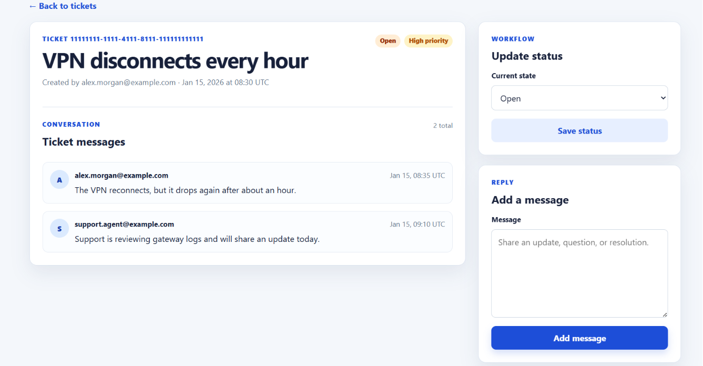
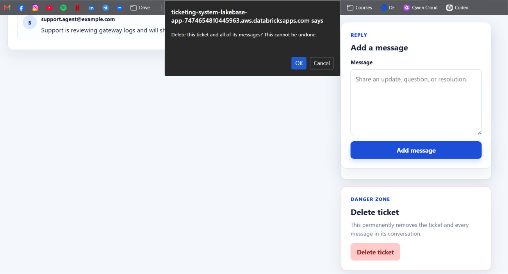

# Lakebase Support Ticketing App — Personal Reflection

## Submission materials

- Databricks App URL: [Support Desk](https://ticketing-system-lakebase-app-7474654810445963.aws.databricksapps.com)
- Source code archive to attach separately: `lakebase-support-ticketing-source.zip`

## Deployed application evidence

*Figure 1. The deployed dashboard reads the operational ticket queue from Lakebase and displays live totals for open, in-progress, and resolved tickets.*

*Figure 2. Users can filter the queue by status and create a new ticket with a selected priority.*

*Figure 3. A selected ticket shows its persisted conversation, current status, status-update control, and add-message form.*

*Figure 4. The delete bonus uses a POST-only action and a browser confirmation before permanently deleting a ticket and its messages.*

## Required reflection

The most difficult part was binding the Databricks App to Lakebase and validating that the app service principal could use rotating OAuth credentials without placing passwords or tokens in the repository. Lakebase is a PostgreSQL operational database optimized for low-latency transactional inserts, updates, referential constraints, and application-serving queries. A traditional analytics table is instead optimized for large scans, aggregations, and batch or streaming analysis rather than ongoing ticket-by-ticket writes. Next, I would add ticket assignment, SLA deadlines, and notifications so the support team can clearly own and respond to requests.

## Final submission check

The supplied images cover the deployed application and the delete bonus. Before submitting, add a separate Lakebase SQL Editor or Tables Editor screenshot that visibly shows the `support_app.tickets` and `support_app.ticket_messages` tables with their seeded sample records; that required database-evidence screenshot is not among the supplied files.
